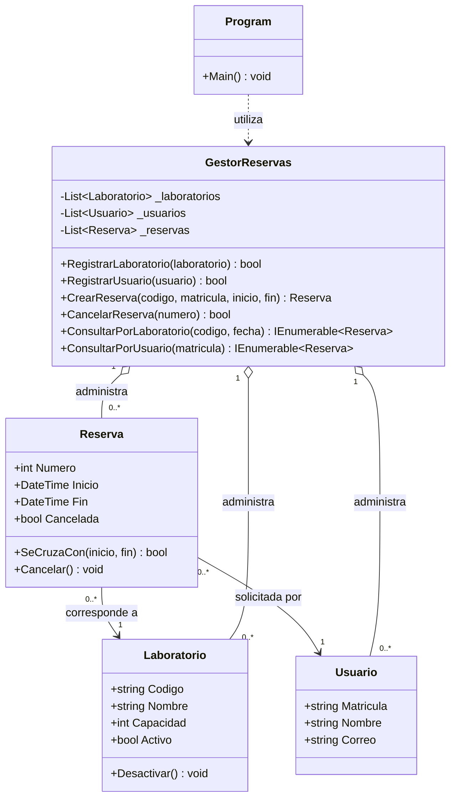

# Modelo UML y relaciones entre clases

## Diagrama de clases

## Explicación de las relaciones

1. **Reserva–Laboratorio:** cada reserva corresponde a un laboratorio. Un mismo laboratorio puede aparecer en varias reservas, siempre que sus horarios no se crucen. La reserva conserva una referencia al objeto `Laboratorio`.
2. **Reserva–Usuario:** cada reserva la solicita un usuario. Una persona puede tener varias reservas en distintos horarios. La reserva conserva una referencia al objeto `Usuario`.
3. **GestorReservas–elementos administrados:** el gestor mantiene colecciones `List<T>` de laboratorios, usuarios y reservas. Su responsabilidad es registrar, buscar, validar, cancelar y consultar. La aplicación de consola `Program` llama al gestor para ejecutar las opciones del menú.

## Organización y responsabilidades

- `Laboratorio` guarda el código, nombre, capacidad y estado; valida sus datos al crearse.
- `Usuario` guarda matrícula, nombre y correo; valida los datos básicos.
- `Reserva` reúne el laboratorio, el usuario y el intervalo de tiempo; comprueba cruces de horario y permite cancelación.
- `GestorReservas` concentra las reglas de administración, por ejemplo impedir códigos o matrículas repetidos y evitar reservas superpuestas para el mismo laboratorio.
- `Program` muestra el menú y recoge los datos de la consola; delega las reglas del negocio en `GestorReservas`.

La separación de estas tareas mejora la cohesión: cada clase tiene una función clara. También limita el acoplamiento, porque el menú no necesita implementar por sí mismo las reglas de disponibilidad.
